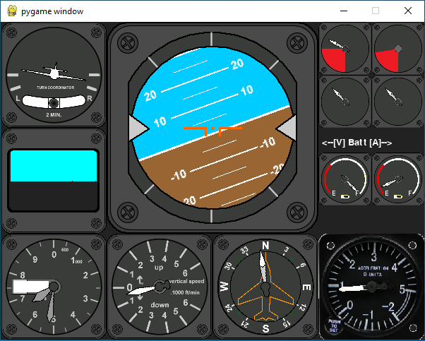
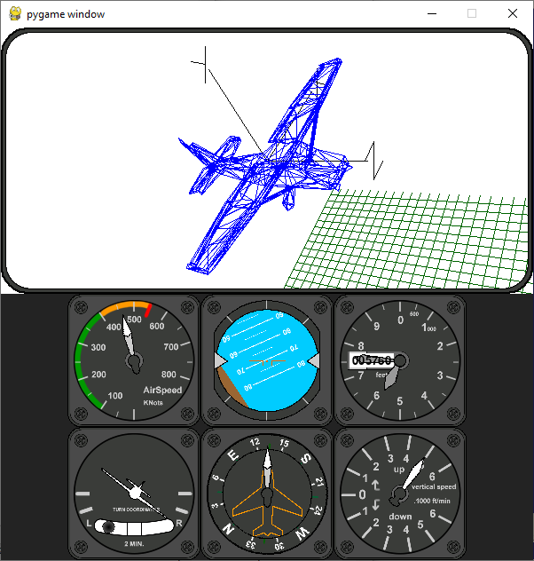

Requires Python and pyGame to run.

http://python.org/
http://www.pygame.org
https://github.com/mrGSOF/3dWireFrame

## Running instructions

- Clone `git clone https://github.com/mrGSOF/3dWireFrame`
- Install 3dWireFrame `pip install .`
- Clone this repo `git clone https://github.com/mrGSOF/GSOF_Cockpit.git`
- Install requirements `pip install -r requirements.txt`
- run 'Demo_Cockpit.py'. (The artificial horizon should follow the mouse.)
- run 'Demo_3DSim.py'. (The artificial horizon should follow the mouse.)
